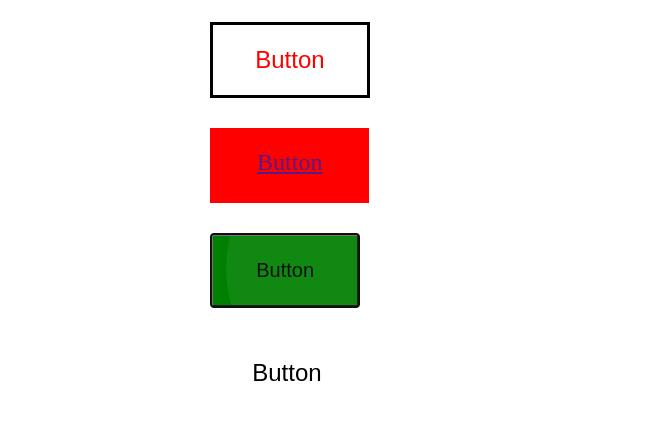

# Ripple Effect CSS PureJS

Most Ripple tools just run an animation from a fix point, This tiny library provide a **ripple effect** which will run from any point the end-user do the action. (CSS + Pure JS)

Demo: https://basemax.github.io/RippleEffectCSS/demo.html

  

  

© Copyright 2021, Max Base
